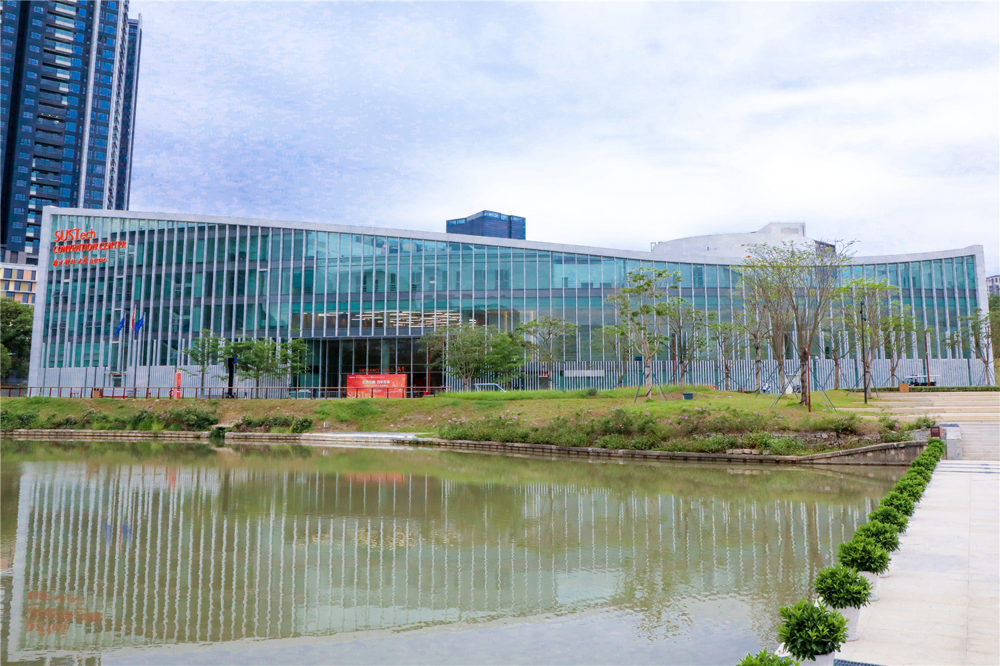
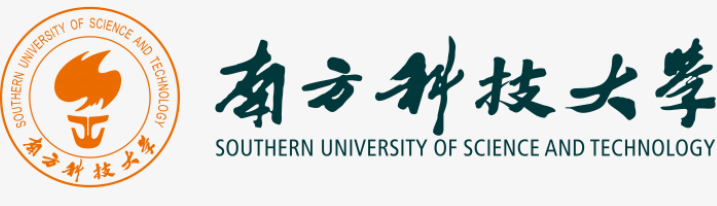
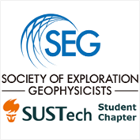
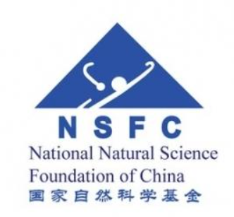

# 课程简介

   

<html>
<head> 
<meta charset="utf-8"> 
</head>
<body>

 

</body>
</html>

data:image/jpg;base64,/9j/4AAQSkZJRgABAQAAAQABAAD/2wBDAAwICQoJBwwKCQoNDAwOER0TERAQESMZGxUdKiUsKyklKCguNEI4LjE/MigoOk46P0RHSktKLTdRV1FIVkJJSkf/2wBDAQwNDREPESITEyJHMCgwR0dHR0dHR0dHR0dHR0dHR0dHR0dHR0dHR0dHR0dHR0dHR0dHR0dHR0dHR0dHR0dHR0f/wAARCARyBngDASIAAhEBAxEB/8QAHwAAAQUBAQEBAQEAAAAAAAAAAAECAwQFBgcICQoL/8QAtRAAAgEDAwIEAwUFBAQAAAF9AQIDAAQRBRIhMUEGE1FhByJxFDKBkaEII0KxwRVS0fAkM2JyggkKFhcYGRolJicoKSo0NTY3ODk6Q0RFRkdISUpTVFVWV1hZWmNkZWZnaGlqc3R1dnd4eXqDhIWGh4iJipKTlJWWl5iZmqKjpKWmp6ipqrKztLW2t7i5usLDxMXGx8jJytLT1NXW19jZ2uHi4+Tl5ufo6erx8vP09fb3+Pn6/8QAHwEAAwEBAQEBAQEBAQAAAAAAAAECAwQFBgcICQoL/8QAtREAAgECBAQDBAcFBAQAAQJ3AAECAxEEBSExBhJBUQdhcRMiMoEIFEKRobHBCSMzUvAVYnLRChYkNOEl8RcYGRomJygpKjU2Nzg5OkNERUZHSElKU1RVVldYWVpjZGVmZ2hpanN0dXZ3eHl6goOEhYaHiImKkpOUlZaXmJmaoqOkpaanqKmqsrO0tba3uLm6wsPExcbHyMnK0tPU1dbX2Nna4uPk5ebn6Onq8vP09fb3+Pn6/9oADAMBAAIRAxEAPwD1WiiigAooooAKKKijkWSNZI2VkYZDKcgj2NAEtFMDA5wc4ODinUALRRRQAUUxXWRA8bBlPIZTkGndqAFooooAKKKSgBaKKKACiiigAooooAKKKKACiiigAooooAKKKKACiiigAooooAKKKKACiiigAooooAKKKKACiiigAooooAKKKKACiiigAooooAKKKKACiiigAooooAKKKKACiiigAooooAKKKKACiiigAooooAKKKKACiiigAooooAKKKKACiiigAooooAKKKKACiiigAooooAKKKKACiiigAooooAKKKKACiiigAooooAKKKKACiiigAooooAKKKKACiiigAooooAKKKKACiiigAooooAKKKKACiiigAooooAKKKKACiiigAooooAKKKKACiiigAooooAKKKKACiiigAooooAKKKKACiiigAooooAKKKKACiiigAooooAKKKKACiiigAooooAKKKKACiiigAooooAKKKKACiiigAooooAKKKKACiiigAooooAKKKKACiiigAooooAKKKKACiiigAooooAKKKKACiiigAooooAKKKKACiiigAooooAKKKKACiiigAooooAKKKKAMLxpLLF4R1GW3nkhlSLcjocFSCDkGuIutc8XReAo9Zl1Sy8udQkYEJEpJJXg9M4BPSu48bDPg7VF9bdq4GKJdR0PwRpF2VjsZpHklZx8rspO1PqQSP+BUAbcep6poXwte71i5Et28O23ODvXeMIGJ6sAcn2Xv1q38MNIn0zwxDPcTTFrseasDNlI1PTaOxIwTXK/FLWzf6xb6RagSQWTqZs/cMrcBT9B6HufSuzOoeMYrgwR6DYPGmAJlu9qHjsCNwx7igDC0ZHf4zavF9onRI4fPKI5CyNhANwHUAPXo9eP2zeJZviPrQ06G0g1SS02v+9ykS/uvmUkcn7vUd/avT9EbU206Ia1HGl4o2yGJ8q+P4hwMZ9KANKuZ8a6xLp+mCzsAX1O/Pk2sa9cnq30A7+tamrarb6XbebNuaRztiiXl5G9FH8z0A5PFc5o15o6ajJrOt65pT6lINqIt4hW2T+4vPX1PegCfwrYDwnBFot1MzNP88U7Mdjvj5kAJwCOoxjI9wa62ua1rW/Ct/pc0N/q+nyQ43fu7lWdSOQV2kncO2Oa5/T/GF5pOnxXN5HJrOjtxFqEA/e

 得益于观测方法、仪器设备、计算技术等方面的长足进步，地球电磁学在过去的十几年间取得了突飞猛进的发展。而另一方面，普通学生和一线地球物理技术人员面对诸多细分方向和如爆炸式增长的文献，往往难以系统而及时地接触到地球电磁学科技发展前沿，甚至对一些基础理论也存在或多或少的一知半解。2023年8月18至20日，第十六届中国国际地球电磁学术研讨会将在广东省深圳市南方科技大学召开。这一会议是我国地球电磁学界两年一度最大的学术活动，预计届时将有超过700位来自全国和世界各地的地球电磁学研究人员、工作者和学生参与这一大会。因此，在国家自然科学基金资助和南科大SEG学生分会的支持下，我们拟借鉴国际一流学术会议做法，将短期课程作为该学术会议的会前会，为与会的青年学者和一线工作人员提供优质的职业发展培训资源。本短期课程将邀请在地球电磁领域做出过较为突出成绩的青年和资深学者以其学术特色为主题讲授课程的不同单元，将地球电磁学基础与前沿短期课程打造为中国地球电磁学界的一项亮点活动。

<html>
<head> 
<meta charset="utf-8"> 
</head>
<body>

                              

</body>
</html>
